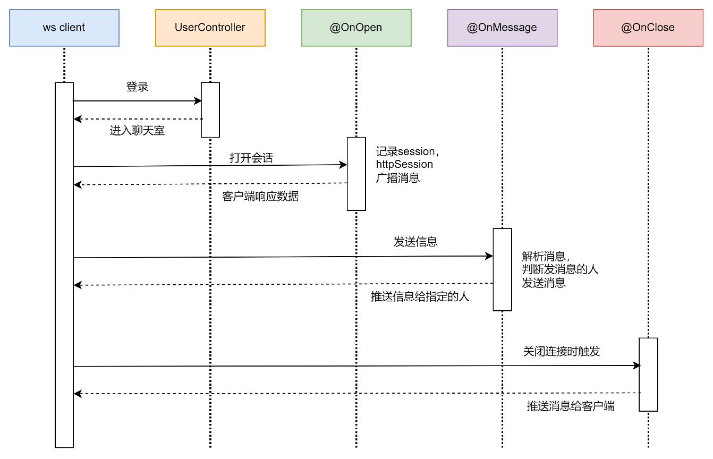

# websocket-demo

> 一个简单的 websocket 使用 demo ，让你快速上手 websocket

## 推送技术

> 自行百度

* 轮询
* 长轮询
* SSE
* websocket

## 时序图



## 步骤

### 导入坐标

```xml
<dependency>
    <groupId>org.springframework.boot</groupId>
    <artifactId>spring-boot-starter-websocket</artifactId>
</dependency>
```

### 编写配置类

扫描添加有@ServerEndpoint的Bean

```java
import org.springframework.context.annotation.Bean;
import org.springframework.context.annotation.Configuration;
import org.springframework.web.socket.server.standard.ServerEndpointExporter;


@Configuration
public class WebsocketConfig {
    @Bean
    public ServerEndpointExporter serverEndpointExporter() {
        return new ServerEndpointExporter();
    }
}

```

### 获取HttpSession对象

```java
import javax.servlet.http.HttpSession;
import javax.websocket.HandshakeResponse;
import javax.websocket.server.HandshakeRequest;
import javax.websocket.server.ServerEndpointConfig;

public class GetHttpSessionConfig extends ServerEndpointConfig.Configurator {
    @Override
    public void modifyHandshake(ServerEndpointConfig sec, HandshakeRequest request, HandshakeResponse response) {
        // 获取 HttpSession 对象
        HttpSession httpSession = (HttpSession) request.getHttpSession();
        // 将 HttpSession 对象保存
        sec.getUserProperties().put(HttpSession.class.getName(), httpSession);
    }
}

```

### 引入配置器

在@ServerEndpoint中引入配置器

```java
@ServerEndpoint(value = "/chat", configurator = GetHttpSessionConfig.class)
```

### 接口

```java
import com.alibaba.fastjson.JSON;
import com.qian.config.GetHttpSessionConfig;
import com.qian.utils.MessageUtils;
import com.qian.ws.pojo.Message;
import org.springframework.stereotype.Component;

import javax.servlet.http.HttpSession;
import javax.websocket.*;
import javax.websocket.server.ServerEndpoint;
import java.util.Map;
import java.util.Set;
import java.util.concurrent.ConcurrentHashMap;

@Component
@ServerEndpoint(value = "/chat", configurator = GetHttpSessionConfig.class)
public class ChatEndpoint {

    private static final Map<String, Session> onlineUsers = new ConcurrentHashMap<>();

    private HttpSession httpSession;

    /**
     * 建立 websocket 连接后被调用
     *
     * @param session 会话
     */
    @OnOpen
    public void onOpen(Session session, EndpointConfig config) {
        // 1. 保存 session
        this.httpSession = (HttpSession) config.getUserProperties().get(HttpSession.class.getName());
        onlineUsers.put(httpSession.getAttribute("user").toString(), session);
        // 2. 广播通知
        broadcastToAll(MessageUtils.getMessage(true, null, getFriendsNameList()));
    }

    /**
     * 发送消息被调用
     *
     * @param message 消息
     */
    @OnMessage
    public void onMessage(String message) {
        try {
            // 将消息推送给指定用户
            Message msg = JSON.parseObject(message, Message.class);
            // 获取 session 对象
            Session session = onlineUsers.get(msg.getToName());
            // 发送 同步 消息
            session.getBasicRemote().sendText(
                    MessageUtils.getMessage(false,
                            this.httpSession.getAttribute("user").toString(),
                            msg.getMessage())
            );
        } catch (Exception e) {
            throw new RuntimeException(e);
        }
    }

    /**
     * 关闭 websocket 连接后被调用
     *
     * @param session 会话
     */
    @OnClose
    public void onClose(Session session) {
        // 1. 移除 session
        onlineUsers.remove(httpSession.getAttribute("user").toString());
        // 2. 广播通知
        broadcastToAll(MessageUtils.getMessage(true, null, getFriendsNameList()));
    }

    /**
     * 广播消息
     *
     * @param message 消息
     */
    private void broadcastToAll(String message) {
        try {
            Set<Map.Entry<String, Session>> entries = onlineUsers.entrySet();
            for (Map.Entry<String, Session> entry : entries) {
                // 获取用户的 session 对象
                Session session = entry.getValue();
                // 发送 同步 消息
                session.getBasicRemote().sendText(message);
            }
        } catch (Exception e) {
            throw new RuntimeException(e);
        }
    }

    /**
     * 获取在线用户列表
     *
     * @return 在线用户列表
     */
    private Set<String> getFriendsNameList() {
        return onlineUsers.keySet();
    }
}
```

### 地址

```
ws://localhost:8080/chat
```

### Tips

如果想换端口启动，全局替换当前接口端口即可，现在端口是：`8080`

如果想换80端口，解决80端口被占用，以管理员身份打开 cmd 窗口

```
// 查看端口占用情况
netsta -ano
// 停止80端口
net stop http
```

